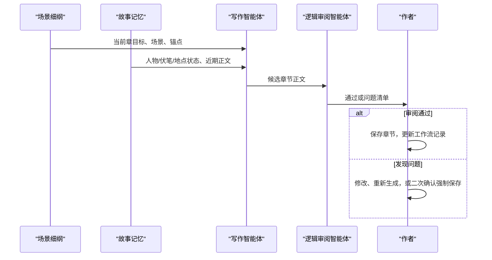

# StoryForge AI

StoryForge AI 是一个可直接在浏览器运行、可安装为 PWA 的长篇故事创作工作台。它把“从灵感到可持续续写的小说”拆成一条可确认、可审阅、可追踪的智能体工作流：每个智能体只处理一种明确的创作资产，并把结构化结果交给下一阶段，而不是一次性让模型生成整部作品。

当前生产入口只有这一条统一工作流；新项目的第一章和后续章节也走同一套上下文、审阅与保存规则。

## 它能做什么

- 将一句故事灵感整理为可确认的创作简报。
- 逐步生成世界观、人物圣经、幕时间线和场景细纲。
- 按细纲逐章生成正文，并在写作后自动进行连续性审阅。
- 对每一幕进行质量评分，最后执行全书审阅。
- 将项目、工作流状态和阶段产物保存到本地；已完成阶段可以回看，未完成阶段不会被跳过。

## 快速开始

### 浏览器运行环境

- Node.js 与项目依赖（首次运行前执行一次 `npm install`）
- 现代浏览器（Chrome、Edge、Firefox 或 Safari 的近期版本）
- Node.js 与项目依赖（仅开发、构建或自行部署时需要）
- 可用的 OpenAI 或 DeepSeek 兼容 API 配置（可选；未配置时可体验内置 Mock 工作流）

### 在浏览器中启动

安装依赖后运行 Web 开发服务器：

```powershell
npm install
npm run dev:web
```

访问终端输出的本地地址（默认是 `http://127.0.0.1:5173`）。浏览器菜单中的“安装应用”可将其作为独立窗口的 PWA 使用。

### 构建与静态部署

```powershell
npm run build:web
```

构建结果位于 `dist/`，是没有服务端依赖的静态文件，可部署到任意支持 HTTPS 静态托管的平台或 Web 服务器。PWA 的 Service Worker 需要 HTTPS（`localhost` 例外）。部署到子路径时请保持构建产物内的相对路径结构不变。

开发与检查命令：

```powershell
npm run typecheck
npm test
npm run build:web
```

### 可选的桌面构建

Electron 桌面壳仍保留给需要桌面文件系统工作流的开发者。它不是浏览器版本的运行前提：

```powershell
npm run build:desktop
npx electron .
```

## 使用方式

1. 创建项目，填写项目名称和故事灵感。
2. 在创意确认界面生成并确认创作简报。
3. 按工作流顺序生成、查看并确认后续资产：世界观、人物、时间线与场景细纲。
4. 进入章节写作阶段后，点击“生成章节”。系统会选择细纲中尚未完成的下一章；不会覆盖已有的作者正文。
5. 查看章节审阅结果：审阅通过时可正常保存；发现问题时可修改后重试，或在二次确认后强制保存。
6. 完成一个幕的章节后执行幕评分；全部内容完成后执行全书审阅。

工作区只允许操作当前阶段。已确认阶段可只读回看；未来阶段保持锁定，避免在缺少上游信息时生成不可靠内容。

## 智能体工作原理

### 1. 一条有状态的创作流水线

工作流不是多个模型随意串联，而是一个持久化状态机。阶段依次为：

```text
intake
  → world_outline
  → character_bible
  → act_timeline
  → scene_outline
  → chapter_draft
  → act_scoring
  → full_review
```

每个阶段有 `locked`（锁定）、`draft`（待生成或待确认）、`regenerating`（重新生成中）、`confirmed`（已确认）或 `optional`（可选）的状态。只有确认当前阶段，下一阶段才会解锁。


生成只产生候选产物；作者确认后，产物才会写入项目工作流并解锁下一步。这让人始终能在关键创作决策处介入，也让后续智能体只接收已经确认的上下文。

### 2. 每个阶段对应的专职智能体

| 阶段 | 调用的技能（Skill） | 智能体产物 | 下游如何使用 |
| --- | --- | --- | --- |
| `intake` | `theme-generator` | 标题、主角、目标、核心冲突、主题 | 为全流程提供创作简报 |
| `world_outline` | `world-generator` + `plot-designer` | 世界文档与总纲 | 约束人物、幕和场景的创作边界 |
| `character_bible` | `character-generator` | 人物档案、动机、缺陷、人物弧 | 写入项目人物库，并供后续阶段引用 |
| `act_timeline` | `act-timeline-generator` | 多幕时间、地点、人物、叙事动作与摘要 | 形成故事的幕级骨架 |
| `scene_outline` | `scene-outline-generator` | 每幕的章节目标、场景和故事锚点 | 决定逐章写作的顺序与目标 |
| `chapter_draft` | `chapter-draft-writer` + `logic-detective` | 章节正文与连续性审阅报告 | 通过审阅后保存并更新写作进度 |
| `act_scoring` | `score-act` | 情节、人物、节奏、细节四项评分与建议 | 供作者修改当前幕 |
| `full_review` | `integrated-gate` | 全书问题清单与总结 | 作为全书交付前的最终检查 |

这里的“智能体”是由明确角色提示词、JSON 输出契约和业务校验共同组成的能力单元。模型负责内容推理和生成；应用负责输入拼装、输出验证、状态推进、持久化和异常提示。因此即使模型输出不符合协议，也不会被直接当成项目资产写入。

### 3. 章节生成：写作智能体与审阅智能体如何配合

章节阶段是两步调用，而不是让审阅结果悄悄覆盖作者内容：



写作前，系统构建一个紧凑的“章节上下文包”，其中包括：

- 当前幕的目标、时间、地点、人物和摘要；
- 当前章的目标、场景拆解与故事锚点；
- 人物状态、未回收伏笔、地点/物品状态等故事记忆；
- 前一幕摘要、最近两章正文，以及与当前目标相关的历史片段。

写作智能体必须返回指定章节编号的完整章节对象；应用会核对编号，防止模型误写成别的章节。随后审阅智能体检查时间线、地点、人物行为和因果链。只有审阅状态为 `passed` 的草稿可以直接保存；`issues_found` 的草稿会保留问题清单，并要求作者明确决定如何处理。

### 4. 下一章如何被安全选择

系统从已确认的场景细纲中找到第一个尚无审阅记录的章节。它会：

1. 跳过已经保存并审阅完成的章节；
2. 允许替换空白的默认章节占位符；
3. 遇到已有真实正文时停止并提示冲突；
4. 在没有细纲或所有细纲章节都完成时给出明确状态。

因此，“生成下一章”不会按最大章节号盲目追加，也不会无提示覆盖作者已经写好的内容。

### 5. 重新生成与质量控制

在某个阶段重新生成时，系统会清理该阶段及其下游依赖的候选资产，并重新锁定后续步骤，避免旧细纲与新世界观混用。幕评分以幕为单位保存，重新评分一个幕不会丢失其他幕的评分。

完整性控制包括：

- 每种阶段产物都经过结构化校验；
- 每章写作结果必须带有与请求一致的章节编号；
- 章节审阅有明确的阻止保存与强制保存二次确认；
- 全书审阅独立于章节审阅，专门汇总全局问题；
- 项目打开时会为旧项目安全迁移工作流状态，保留原有正文和人物资产。

## 数据与模型配置

### 模型提供方与浏览器密钥

浏览器版本支持 OpenAI 和 DeepSeek 兼容接口。请在应用设置中填写提供方、Base URL、模型和你自己的 API Key。密钥仅保存于**当前浏览器的 IndexedDB**，不会写入项目数据、JSON 备份、下载文件、URL 或仓库；清除密钥后刷新页面也不会恢复。

浏览器会直接从你的设备请求模型服务，不经过 StoryForge 的服务器或代理。因此模型服务的 Base URL 必须允许该网页来源的 CORS 请求；若出现跨域错误，请使用提供商支持浏览器直连的端点或调整你自己服务的 CORS 配置。不要为了绕过 CORS 将 API Key 放到公开前端代码、查询参数或共享的反向代理中。

有有效本地配置时，工作流在一次运行中只使用真实模型 Provider；未配置时只使用内置 Mock Provider，以保证工作流协议和界面行为仍可验证。真实模型请求失败会报告错误，不会悄悄降级为 Mock 内容。

### 本地保存、备份与恢复

浏览器版本把项目保存在当前浏览器的 IndexedDB 中，包含：

- 项目基本信息、世界观、人物、章节正文和摘要；
- 工作流当前阶段及各阶段状态；
- 创意简报、世界观大纲、人物圣经、时间线、场景细纲、评分和审阅报告；
- 故事记忆与章节审阅记录。

这些结构化数据使应用能够在重启后继续从正确的阶段续写，而无需重新让模型猜测已经确认过的设定。

浏览器存储会受清理站点数据、隐私模式或更换浏览器影响。请在项目列表中定期导出 JSON 备份；需要恢复或迁移时可导入该 JSON，导入会创建一份新的本地项目，不覆盖已有项目。也可以下载小说 TXT 供阅读或交付。备份与 TXT 下载均不会包含 API Key。

## 项目结构

```text
src/
  main/                         # 可选 Electron 主进程与 IPC
  preload/                      # 可选桌面壳暴露的 API
  renderer/
    App.tsx                     # UI 编排与工作流操作入口
    components/                 # 创作工作区、上下文栏、设置与审计界面
    services/
      workflowService.ts        # 渲染层唯一的工作流服务入口
      workflowCore.ts           # 状态机与阶段推进规则
      workflowStageActions.ts   # 调用能力并校验阶段产物
      workflowStageInput.ts     # 为每个阶段组合上游上下文
      workflowChapterLoop.ts    # 构建章节上下文并执行写作/审阅
      workflowNextChapter.ts    # 安全解析下一篇待写章节
      chapterContext.ts         # 章节上下文包与故事记忆选择
      browser/                  # IndexedDB、浏览器 AI 调用与下载服务
      plugins/
        skillStoryPlugin.ts     # 真实模型 Skill Provider
        mockStoryPlugin.ts      # 开发/测试 Mock Provider
  shared/
    types.ts                    # 工作流、产物与项目的共享类型
    workflowDefaults.ts         # 初始状态与默认工作流
    workflowMigration.ts        # 旧项目工作流状态迁移
  tests/                        # Vitest 单元与工作流回归测试
docs/
  api/                          # 工作流分析、接口与设计说明
  superpowers/specs/            # 已记录的设计规格
benchmark-output/               # 历史真实模型 A/B 审计证据
```

## 验证与审计

基础质量检查：

```powershell
npm run typecheck
npm test
npm run build:web
git diff --check
```

仓库保留了统一工作流与旧流程的真实模型 A/B 盲评材料和结构化基准产物。它们用于验证统一链路的质量与兼容性；日常开发或界面改动不需要重复执行高成本的真实模型批量评测。

更多技术背景可参阅：

- [工作流原理与历史问题分析](docs/api/workflow-analysis.md)
- [统一工作流入口与旧项目迁移设计](docs/superpowers/specs/2026-07-27-unified-entrypoint-legacy-migration-design.md)
- [工作流 UI 交互设计](docs/superpowers/specs/2026-07-28-workflow-ui-interaction-design.md)
- [真实模型 A/B 盲评记录表](docs/benchmark-real-model-evaluation.md)

